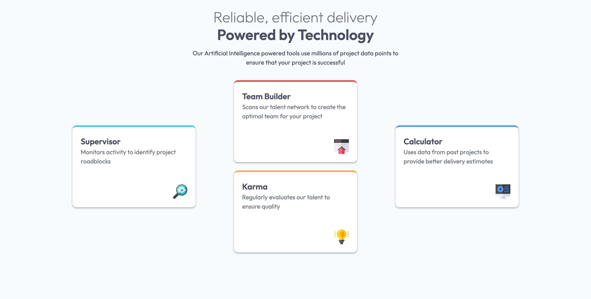

# Frontend Mentor - Four card feature section solution

This is a solution to the [Four card feature section challenge on Frontend Mentor](https://www.frontendmentor.io/challenges/four-card-feature-section-weK1eFYK). Frontend Mentor challenges help you improve your coding skills by building realistic projects. 

## Table of contents

- [Overview](#overview)
  - [The challenge](#the-challenge)
  - [Screenshot](#screenshot)
  - [Links](#links)
- [My process](#my-process)
  - [Built with](#built-with)
  - [What I learned](#what-i-learned)
  - [Useful resources](#useful-resources)
  - [AI Collaboration](#ai-collaboration)
- [Author](#author)

## Overview

### The challenge

Users should be able to:

- View the optimal layout for the site depending on their device's screen size

### Screenshot

### Links

- Solution URL: [GitHub](https://github.com/ThePageGuy/four-card-feature-section)
- Live Site URL: [Demo](https://thepageguy.github.io/four-card-feature-section/)

## My process

### Built with

- Semantic HTML5 markup
- CSS custom properties
- Flexbox
- CSS Grid
- Mobile-first workflow

### What I learned

Following an mobile approach really help reduce the amount of works needed to make it responsive.
Also for now using the flex columns with gap, is a way I got the spaccing to look good, without having to define individual element margins.

### Useful resources

- [Validation Service](https://validator.w3.org/#validate_by_input) - Help to check that both my HTML and CSS are W3C acceptable.
- [PurifyCSS Online](https://purifycss.online/) - Help remove unused CSS Rules.

### AI Collaboration

I first completed the project by myself. Later I used ChatGPT to be my mentor and see if my approach was following correct WCAG rules. Then I asked for his feedback of what can be improved for better responsiveness and better WCAG score.

## Author

- GitHub - [@ThePageGuy](https://github.com/ThePageGuy)
- Frontend Mentor - [@ThePageGuy](https://www.frontendmentor.io/profile/ThePageGuy)